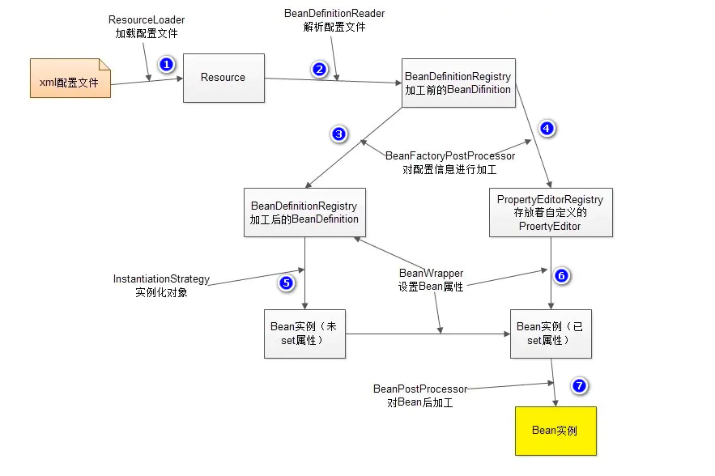
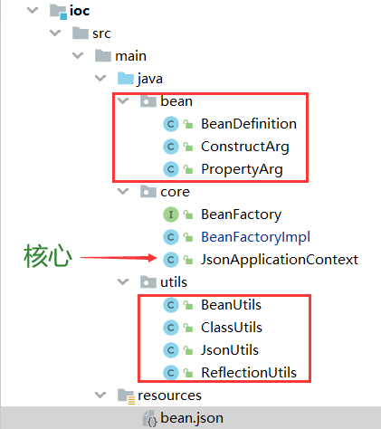

# Spring-ioc原理及手动实现


## 一、ioc 原理图



* `ResourceLoader`加载 xml 配置文件，生成一个资源对象`Resource`；然后由 `BeanDefinitionReader`去读取Resource所指向的配置文件资源，然后解析配置文件；对于配置文件中配置的每一个<bean> 解析为`BeanDefinition`对象，并且保存在`BeanDefinitionRegistry`中；
* ioc容器扫描`BeanDefinitionRegistry`中的`BeanDefinition`；调用`InstantiationStrategy`进行 Bean 的实例化工作；
* 最后通过使用`BeanWrapper`来设置 Bean 的属性完成 Bean实例的生成。

> 特别的：单例Bean缓存池：Spring 在DefaultSingletonBeanRegistry类中提供了一个用于缓存单实例 Bean 的**缓存器**，它是一个用HashMap实现的缓存器，单实例的Bean**以beanName为键保存在这个HashMap**中


## 二、ioc主要的实现步骤

1. 初始化 ioc 容器；
2. 读取配置文件；
3. 将配置文件的内容转化为容器识别的数据结构（这个结构在Spring中叫做  `BeanDefinition`）；
4. 利用数据结构依次实现实例化对象；
5. 注入对象间的依赖关系。


## 三、自己实现 spring ioc

> 参考：https://juejin.cn/post/6844903550061903879    学到了很多，感谢大佬！

考虑到对于 xml文件解析的复杂性，这里我使用 json格式的文件作为配置文件，实现起来更加简单。


### 3.1 项目结构



* **bean：**bean包下主要存放的是项目中用到的数据结构，比如配置文件解析后生成的容器能够理解的 `BeanDefinition`对象；

* **core：**core包下主要存放的是 ioc 核心实现过程，包括了 `JsonApplicationContext`，其实也就是 spring ioc 容器的使用接口`ApplicationContext`；
* **utils：**实现过程中用到的工具类，比如 json文件读取工具类、bean实例化工具类、依赖注入工具类 reflectionUtils、类加载工具类；


### 3.2 步骤(一)、初始化容器

#### （1）初始化中用到的数据结构

```java
    //存储所有已经实例化的Bean对象
    private static final ConcurrentHashMap<String,Object> beanMap = new ConcurrentHashMap<>();

    //存储未实例化的BeanDefinition对象
    private static final ConcurrentHashMap<String,BeanDefinition> beanDefinitionMap = new ConcurrentHashMap<>();

    //存储容器中所有Bean对象的名称
    private static final Set<String> beanNameSet = Collections.synchronizedSet(new HashSet<>());
```

`beanMap`：ConcurrentHashMap类型，保证多线程下的安全性，存储所有已经实例化完成的Bean对象；

`beanDefinitionMap`：ConcurrentHashMap类型，保证多线程下的安全性，存储所有从配置文件读取出来的 BeanDefinition 对象；

`beanNameSet`：通过 Collections.synchorizedSet() 生成线程安全的 set集合，存储配置文件中所有Bean对象的名称；

#### （2）BeanDefinition 对象的定义

```java
@Data
@ToString
public class BeanDefinition {
    //名称
    private String name;
    //类的名称
    private String className;
    //接口名称
    private String interfaceName;
    //构造方法参数
    private List<ConstructArg> constructArgs;
//    private List<PropertyArg> propertyArgs;
}
```

`BeanDefinition` 对象至少应该包含名称、类的名称、接口名称、构造方法参数。


### 3.2 步骤(二)、配置文件解析，生成 BeanDefinition 对象

json 文件主要通过类加载器解析配置文件生成输入流，然后结合`ObjectMapper` 生成 BeanDefinition 对象集合。

然后要将从配置文件中解析出的 BeanDefinition 对象加入到集合 beanDefinitionMap 中。


### 3.3 步骤(三)、Bean对象初始化 ----->  getBean(xxxx)

>  `getBean(xxxx)` 方法首先会从集合 `beanMap`中拿对应的Bean对象；如果容器中不存在就要进行对象的初始化操作。
>
>   对于这些刚完成初始化的 Bean 对象，还需要对它们进行属性注入操作。

```java
    public Object getBean(String name) throws Exception {
        //1.容器中存在直接返回
        if (beanMap.containsKey(name)){
            return beanMap.get(name);
        }
        //2.容器中不存在就进行对象初始化
        Object bean = createBean(beanDefinitionMap.get(name));

        //3. 对生成的Bean对象进行依赖注入
        if(bean != null){
             // 对象内部依赖注入
             populatebean(bean);
             // 生产完成的对象加入到容器中
             beanMap.put(name,bean);
        }
        return bean;
    }
```


```java
private Object createBean(BeanDefinition beanDefinition){
    //1. 根据Bean对象名称获取字节码对象Class
    String beanName = beanDefinition.getClassName();
    Class clz = ClassUtils.loadClass(beanName);
    if(clz == null)
         throw new RuntimeException("不能够根据名称找到Bean对象...");

    //2. 根据BeanDefinition生成构造器所需参数
    List<ConstructArg> constructArgList = beanDefinition.getConstructArgs();
    try {
        // 如果构造器的参数列表不为空，要先获取对应参数的值、对应的构造方法
        if(constructArgList!=null && !constructArgList.isEmpty()){
           // 生成所有构造函数参数对应的Bean对象实体
           List<Object> objectList = new ArrayList<>();
           for(ConstructArg constructorArg:constructArgList){
               if(constructorArg.getValue() != null){
                   objectList.add(constructorArg.getValue());
               }
               else
                   objectList.add(getBean(constructorArg.getRef()));
           }
           // 从对象实体的集合中生成所有对象的Class对象数组，采用 stream().map(xxxx)
           Class[] constructorArgTypes = objectList.stream().map(x->x.getClass()).collect(Collectors.toList()).toArray(new Class[objectList.size()]);
           // 根据参数Class[] 数组获取到对应格式的构造器
           Constructor constructor = clz.getConstructor(constructorArgTypes);
           return BeanUtils.instancedByCglib(clz,constructor,objectList.toArray());
        }

        //否则说明参数列表为空，直接生成
        else
            return BeanUtils.instancedByCglib(clz,null,null);
    } catch (Exception e) {
        return null;
    }
}
```
`createBean(BeanDefinition bean)` 方法需要根据 BeanDefinition 对象创建出目标Bean对象。步骤如下：

1. 根据 BeanDefinition 的类名称加载当前类，从而获取到 Class 对象；
2. 根据当前情况生成 BeanDefinition 中构造方法参数集合中对应的参数，构造方法参数集合可能需要传入其它Bean 对象，那么就需要进行递归的生成；
3. 获取到 BeanDefinition 构造方法参数集合对应的 Class数组，涉及到从集合转化为指定类型数组可以通过 stream() 流来转换。
4. 根据生成的 Class数组选择对应的构造器，然后将 Class对象、构造器、构造方法参数集合一起传入，通过 Cglib 代理生成代理类(目标 Bean 对象)；
5. 最后通过反射来为指定属性设置值，进行Bean 对象的依赖注入。


```java
    // 依赖注入
    private void populatebean(Object bean) throws Exception {
        Field[] fields = bean.getClass().getSuperclass().getDeclaredFields();
        if(fields!=null && fields.length>0){
            // 循环遍历每个Field对象
            for(Field field:fields){
                String fieldName = field.getName();
                // 如果配置文件中存在对应的Bean对象，就注入
                if(beanNameSet.contains(fieldName)){
                    Object fieldBean = getBean(fieldName);
                    ReflectionUtils.insertField(field,bean,fieldBean);
                }
            }
        }
    }
```

https://juejin.cn/post/6844904150723985415#comment


## 四、Spring Ioc 的好处

ioc的思想的核心地方在于，资源不由使用资源的双方去管理，而由不使用资源的第三方去管理，这样可以带来很多好处。

第一是资源的集中管理，实现资源的可配置和易管理。

第二是降低了使用资源双方的依赖程度，也就是我们说的耦合度。